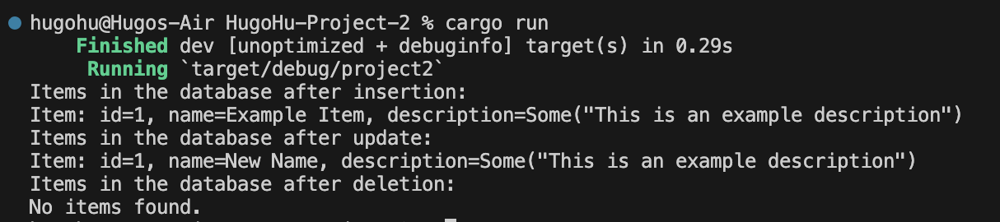
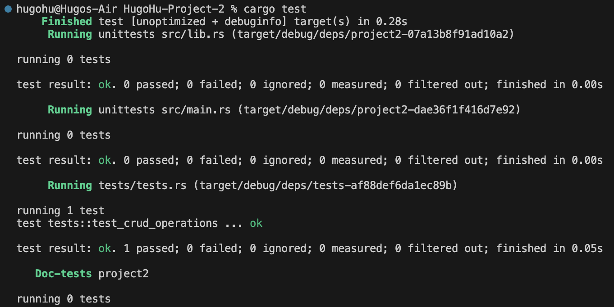
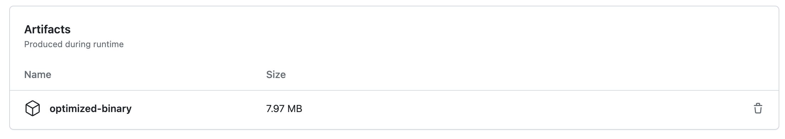

[](https://github.com/nogibjj/HugoHu-Project-2/actions/workflows/lint.yml)

[](https://github.com/nogibjj/HugoHu-Project-2/actions/workflows/rustfmt.yml)

[](https://github.com/nogibjj/HugoHu-Project-2/actions/workflows/binary.yml)

[](https://github.com/nogibjj/HugoHu-Project-2/actions/workflows/tests.yml)


## Individual Project #2: Rust CLI Binary with SQLite

### Description
This project is a CLI binary written in Rust that uses MySQL to store data. The program shows the CRUD (Create, Read, Update and Delete) operations as well as tests in pure Rust language.

**Note:** I'm using ```MySQL``` instead of SQLite because previously I have configured and used MySQL for most projects.

### Dependencies
- Rust
```bash
# Download Rust
curl --proto '=https' --tlsv1.2 -sSf https://sh.rustup.rs | sh
```
- MySQL
```bash
# Download MySQL
sudo apt install mysql-server
# Start MySQL service and setup your root password
sudo systemctl start mysql
# Create a default database
mysql -u root -p
CREATE DATABASE mydb;
```

### How to run
1. Clone the repository
2. Run `cargo run` in the root directory of the project


### Result
We first create a table called ```items```, if the table exists, just ignore this creation. Next, we insert one item ```id=1```into the table. Then, we read the item from the table. After that, we update the item with ```name=New Name```. Finally, we delete the item from the table. Therefore, no items left in the database. 

The result is shown below.






### Effective error handling in Rust
The ```?``` operator is used to propagate errors, making the code more concise and readable.


### Implementation of Rust's unique features
1. **Error Handling with Result:** Rust's Result type is used throughout the code to handle and propagate errors. This is a unique feature of Rust that enforces strict error handling and ensures that you explicitly handle potential errors.
2. **Mutable References:** The code uses mutable references (&mut) to work with database connections, ensuring safe and efficient resource management.
3. **Pattern Matching:** Pattern matching is used to destructure tuples returned from database queries, making the code more readable and concise.


### Optimized Rust Binary

